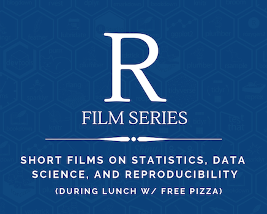

# R Film Series 2019

Please join Fridays from 12 - 1 pm this spring for screenings of excellent talks from the recent Rstudio::conf. We'll be meeting in ETC 105B. Many/most of these talks have useful gems even to folks with only limited exposure to programming and R.

Come for the talks, stay for the follow-up conversation (and free pizza).

* * *

### Creativity and Tidy Timeseries - February 15th
[Cultivating creativity in data work](https://resources.rstudio.com/rstudio-conf-2019/cultivating-creativity-in-data-work) - Hilary Parker  
Traditionally, statistical training has focused primarily on mathematical derivations, proofs of statistical tests, and the general correctness of what methods to use for certain applications. However, this is only one dimension of the practice of doing analysis. Other dimensions include the technical mastery of a language and tooling system, and most importantly the construction of a convincing narrative tailored to a specific audience, with the ultimate goal of them accepting the analysis. These "softer" aspects of analysis are difficult to teach, perhaps more so when the field is framed as mathematics and often housed in mathematics departments. In this talk, I discuss an alternative framework for viewing the field, borrowing upon the past work in other fields such as design. Looking forward, we as a field can borrow from these fields to cultivate and hone the creative lens so necessary to the success of applied work.

[Melt the clock Tidy time series analysis](https://resources.rstudio.com/rstudio-conf-2019/melt-the-clock-tidy-time-series-analysis) - Earo Wang

Time series can be frustrating to work with, particularly when processing raw data into model-ready data. This work presents two new packages that address a gap in existing methodology for time series analysis (raised in rstudio::conf 2018). The tsibble package supports organizing and manipulating modern time series, leveraging tidy data principles along with contextual semantics: index and key. The tsibble data structure seamlessly flows into forecasting routines. The fable package is a tidy renovation of the forecast package. It promotes transparent forecasting practices and concise model representations, to empower analysts tackling a broad domain of forecasting problems. This collection of packages form the tidyverts, which facilitates a fluent and fluid workflow for analyzing time series.

### Animated Graphics - February 22nd
[gganimate cookbook](https://resources.rstudio.com/rstudio-conf-2019/gganimate-live-cookbook) - Thomas Lin Pedersen

[Visualizing uncertainty with hypothetical outcomes plots](https://resources.rstudio.com/rstudio-conf-2019/visualizing-uncertainty-with-hypothetical-outcomes-plots) - Claus Wilke  
Uncertainty is a key component of statistical inference. However, uncertainty is not easy to convey effectively in data visualizations. For example, viewers have a tendency to interpret visualizations of the most likely outcome as the only possible one. Viewers may also misjudge the likelihood of different possible outcomes or the extent to which moderately rare outcomes may deviate from the expectation. One way in which we can help the viewer grasp the amount of uncertainty present in a dataset is by showing a variety of different possible modeling outcomes at once. For example, in a linear regression, we could plot a number of different regression lines with slopes and intercepts drawn from the range of likely values, as determined by the variation in the data. Such visualizations are called Hypothetical Outcomes Plots (HOPs). HOPs can be made in static form, showing the various hypothetical outcomes all at once, or preferably in an animated form, where the display cycles between the different hypothetical outcomes. With recent progress in ggplot2-based animation, via gganimate, as well as packages such as tidybayes that make it easy to generate hypothetical outcomes, we can easily produce animated HOPs in a few lines of R code. This presentation will cover the key concepts, packages, and techniques to generate such visualizations.

### How to Teach Programming - March 1st

### Spatial Statistics and Mapping - March 8th

### The Unreasonable Effectiveness of Public Work - March 15th

### Case Studies in Social Science - March 22nd

### Scientific Reproducibility - April 5th

### Writing Better R - April 12th

